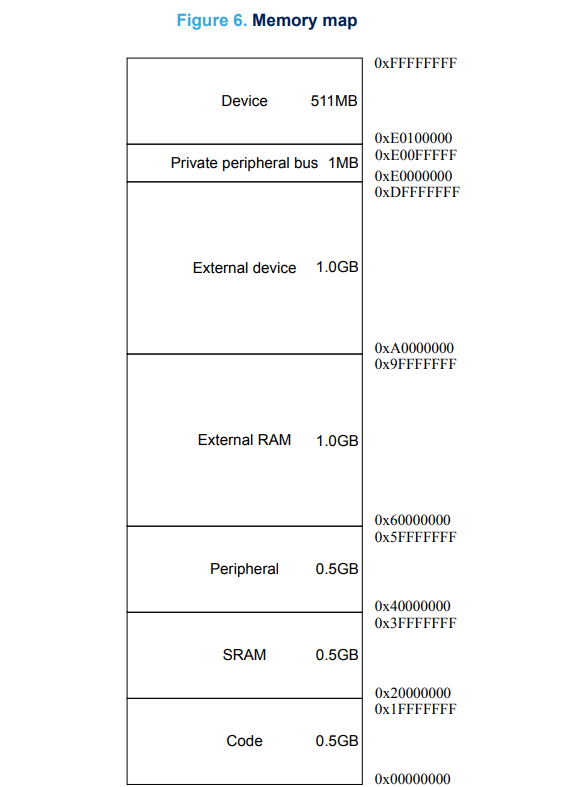

# ECE6780 Pre-Lab 1

## Questions

### What is a commit in the context of git?

A commit takes a snapshot of an updated github repository, giving it a hash map for segments of the repository and is able to use that map to retrieve older versions of the repository.

### How much memory and FLASH storage does the STM32F072R8 have?

Using the RM0091 Reference Manual, we can find information on the microcontroller for a variety of different types.

> STM32F07xS devices feature 16 Kbytes of static SRAM *(RM0091 Rev 10, Page 52)*.

The STM32F072R8 has 16 kilobytes of static SRAM. Using the same manual we can find the flash memory storage capacity

> The memory organization of STM32F07x and STM32F09x devices is based on a main flash
memory block containing up to 128 pages of 2 Kbytes or up to 64 sectors of 4 Kbytes. *(RM0091 Rev 10, Page 56)*.

The manual officially says microcontrollers with the -7x prefix has up to 256 kilobytes, however, when looking at the official datasheet for the STM32F072x8, it shows that this microcontroller has 128 kilobytes of FLASH storage.

> 64 to 128 Kbytes of Flash memory *(DS9826 Rev 6, Page 1)*

The STM32F072R8 has 128 kilobytes of FLASH memory.

### What does the acronym "HAL" stand for?

> In computers, a hardware abstraction layer (HAL) is a layer of programming that allows a computer OS to interact with a hardware device at a general or abstract level rather than at a detailed hardware level. *([Mobile Cloud Computing](https://www.sciencedirect.com/science/chapter/monograph/pii/B978012809641300003X), 2018, pages 31-64)*

HAL stands for "Hardware Abstraction Layer". A well designed HAL allows for hardware to be written on many different devices without hardware dependencies that may make it fail.

### What is the STM32CubeMX program used for?

> STM32CubeMX is a graphical tool that allows a very easy configuration of STM32 microcontrollers and microprocessors, as well as the generation of the corresponding initialization C code for the Arm Cortex-M core or a partial Linux Device Tree for the Arm Cortex-A core, through a step-by-step process. *([STM32Cube Initialization Code Generator](https://www.st.com/en/development-tools/stm32cubemx.html), STMicroelectronics)*

The STM32CubeMX is a tool provided by STMelectronics to help configure specific STM32 microcontrollers and microprocessors.

> The STM32CubeMX tool calculates and provides the I2C_TIMINGR content in the I2C configuration window *(RM0091 Rev 10, Page 638)*.

Using the reference manual for the STM32F0x2 microcontrollers, we find that the STM32CubeMX can provide more accurate timing measurements for the I2C_TIMINGR register which is important to get the most efficient timing out of our I2C devices.

### Why can't a "bare-metal" embedded application return from the main function?

The main function essentially acts as a loop for the embedded application, which contains the overarching program related to the embedded application. This is because a property of embedded systems is that they should be able to "run forever" (Professor Gaillardon). If the embedded application returns from the main function, then the application would stop entirely unless an interrupt were programmed to reset its function. This is assuming there is no operating system installed, which I do not think is recommended for the microcontrollers we are using.

### In the system's memory table, are the peripheral registers higher or lower in address than the SRAM?

 
*(PM0215 Rev 2, Page 12)*

In the ststem's memory table, the peripheral registers are higher in address to the SRAM.

### What information does each of the four main datasheets/manuals used in the labs provide?

- The RM0091 is a reference manual that provides all information on the STM32F0x1/STM32F0x2/STM32F0x8 hardware peripherals.
- The PM0215 is a programming manual that provides information on how data is organized and represented in the STM32 microcontrollers.
- The UM1690 is a user manual that provides information on the layout and pinout of the STM32F0 Discovery Board.
- The DS9826 is a datasheet for the chipset of the STM32F0 chip. This includes the physical capacities and loads of the microcontroller, memory, and peripherals.
- Additionally, I found UM1725, a user manual for the hardware abstraction layer used in STM32F0 microcontrollers.

### Why do STM32F0 devices not recognize inputs/outputs on a chip by physical pin numbering?

The STM32F0 chips themselves do not know what the inputs and outputs represent, and require necessary peripherals to fulfill the requirements detailed in their documentation. For example, crystals, capacitors, sensors, and resets may need to be physically added for the system to work properly. On our discovery board, an entire peripheral for ease of use programming and communication to the STM32F0 chip is added in the Embedded ST-LINK/V2 *(UM1690 Rev 3, Page 10)*.

### What is the name of ST's header file that defines names for the peripheral registers?

> In general, low-layer drivers include only the STM32 CMSIS device file.
> #include "stm32yyxx.h"
> *(UM1725 Rev 8, Page 40)*

stm32f0xx.h is the header file that contains the definitions of the peripheral registers for our specific microcontroller. I got that information from the user manual for an f4 version of the microcontroller.

### What bitwise operator would you use to set a bit in a register?

You would use the bitwise "OR" operator to set a given bit in a register to 1.  

### What peripheral enables the system clock to other peripherals?

The Reset Clock Control (RCC) peripheral manages the system clock to other peripherals.

> Various clock sources can be used to drive the system clock (SYSCLK)... Status bits in the clock control register (RCC_CR) indicate which clock(s) is (are) ready and which clock is currently used as a system clock. *(RM0091 Rev 10, Page 105)*.

The RCC can control a lot of different properties of the system clock, including pre-scalars, clock output, phase multiplication factors, and more.

### What peripheral do the HAL library delay functions use?

> HAL_Delay(). this function implements a delay (expressed in milliseconds) using the SysTick timer. *(UM1725, Rev 8, Page 31)*

This delay function uses a variable in the SysTick Interrupt Service Routine (ISR) to accurately give a delay in milliseconds. These ISRs require physical clocks to operate at specific moments in time, so this means that if another interrupt is using this HAL_Delay function, the SysTick ISR needs to take priority. 

### Why should you avoid floating-point values on an STM32F0?

The STM32F0 lacks a floating point unit (FPU), and would be very difficult to implement with the hardware in the microcontroller. Floating point values are approximate representations of decimal values for arithmetic use, and can approximate up to a certain degree of freedom depending on its implementation. [IEEE Standard 754](https://www.geeksforgeeks.org/computer-organization-architecture/ieee-standard-754-floating-point-numbers/), is a common way in how decimal values can be approximated and configured with one- or two- degrees of precision.