# ECE6780 Post-Lab 1

## Questions

### What are the GPIO control registers that the lab mentions? Briefly describe each of their

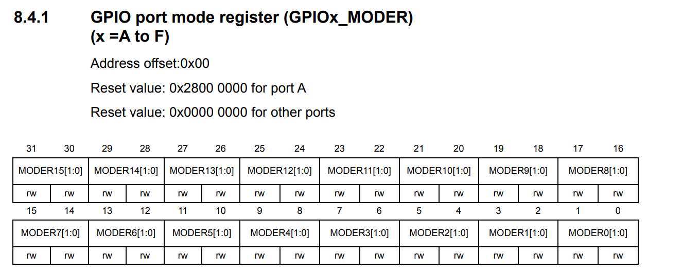 
*(RM0091 Rev 10, Page 158)*

The mode register (MODER) is a 32-bit register which controls the type of operation mode the corrseponding GPIO pin is in. The operation modes are input mode (00), general purpose output mode (01), alternate function mode (10), and analog mode (11). The 16 pins are given 2 bits each in the mode register, thus making the full 32 bits.

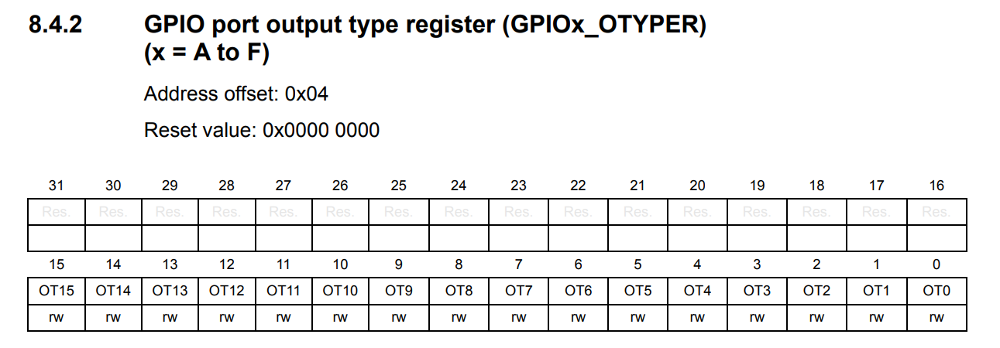 
*(RM0091 Rev 10, Page 158)*

The output type register (OTYPER) is a 16-bit register which controls the output type of a given pin. This would only affect the general purpose output mode and the alternate function mode. Clearing the corresponding OTYPER register to 0 makes the pin a push-pull output type, while setting the register to 1 makes the pin an open-drain output type.

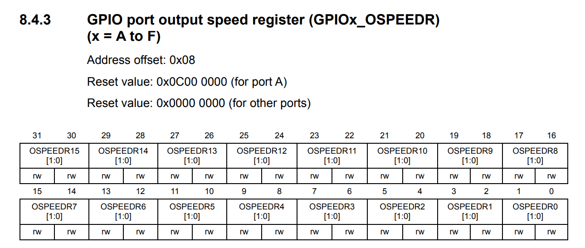 
*(RM0091 Rev 10, Page 159)*

The output speed register (OSPEEDR) is a 32-bit register which controls the output speed of a given pin. This would only affect the general purpose output mode and the alternate function mode. Clearing the first bit in the corresponding pin's register (x0) makes the pin have a low-speed output, setting the first bit and clearing the second bit in the corresponding pin's register (01) makes the pin have a medium-speed output, setting both the first and second bit in the corresponding pin's register (11) makes the pin have a high-speed output.

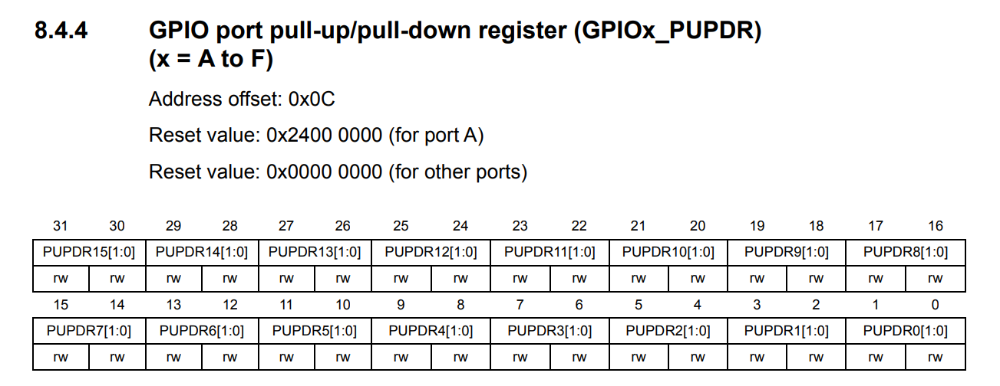 
*(RM0091 Rev 10, Page 159)*

The pull-up, pull-down register (PUPDR) is a 32-bit register which controls the pull-up and pull-down resistors of a given GPIO pin. This affects all operation modes. The possible configurations are no pull-up, no pull-down (00), pull-up resistor (01), pull-down resistor (10), and reserved (11). Reserved configuration is not meant to be used.

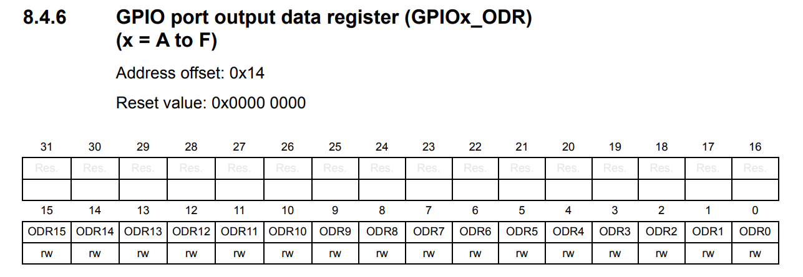 
*(RM0091 Rev 10, Page 160)*

The output data register (ODR) is a 16-bit register which controls the output data of an output pin. This would only affect the general purpose output mode and the alternate function mode. Setting the corresponding pin's bit to 1 gives a high output (1), and clearing the corresponding pin's bit to 0 gives a low output (0).

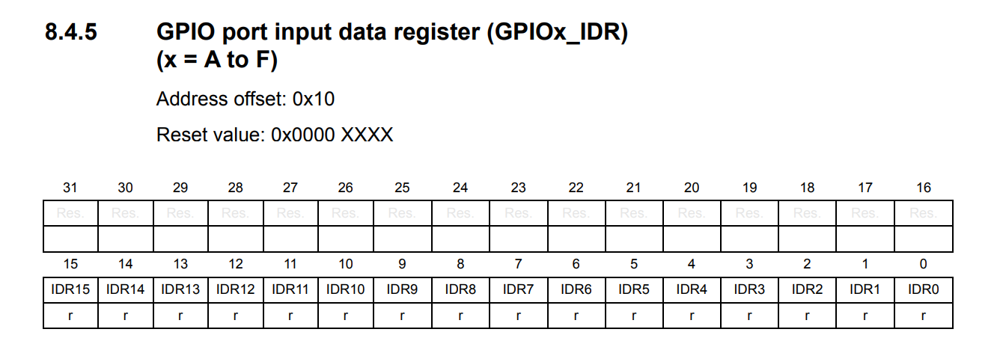 
*(RM0091 Rev 10, Page 160)*

The input data register (IDR) is a 16-bit register which controls the input data of an input pin. This would only affect the input mode and analog mode. These bits are read-only, and can only be operated using bitwise & and | to affect data in the program.

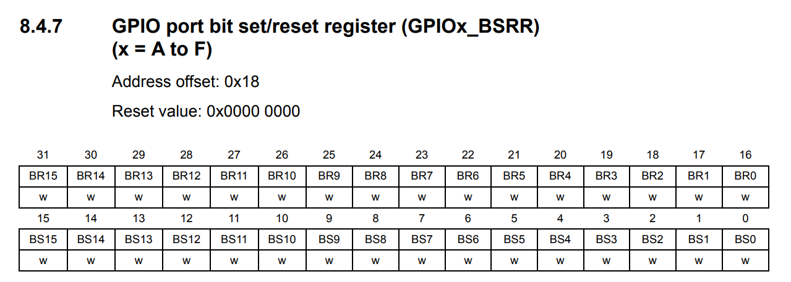 
*(RM0091 Rev 10, Page 161)*

The atomic bit-set reset register (BSRR) is a 32-bit register which controls the output data of an output pin. This would only affect the general purpose output mode and the alternate function mode. This is a register which directly affects the ODR register, setting one set of 16 bits to 1, clears the corresponding pin's output to 0, and setting the other set of 16 bits to 1, sets the corresponding pin's output to 1. This separates the clearing and setting function to 2 separate bits, which may be more explicit for some implementations.

### What values would you want to write to the bits controlling a pin in the GPIOx_MODER register in order to set it to analog mode?

You would want to set both the first and second bit of a corresponding pin's registers to 1, giving a 11 configuration to a given register. 

### Examine the bit descriptions in GPIOx_BSRR register: which bit would you want to set to clear the fourth bit in the ODR?

Examining the BSRR register, to clear the fourth bit in ODR, you would need to set BR3 or the 19th bit in the BSRR register. This could be done by writing:

> GPIOx -> BSRR |= (1 << 19);

### Perform the following bitwise operations:

> 0xAD | 0xC7 = ?
> - - - - - - - -
> &nbsp;&nbsp;&nbsp;0b 1010 1101
> OR 0b 1100 0111
> - - - - - - - -
> &nbsp;&nbsp;&nbsp;0b 1110 1111
> &nbsp;&nbsp;&nbsp;0x E    F
> - - - - - - - -
> 0xEF

The OR operation results in 0xEF.

> 0xAD & 0xC7 = ?
> - - - - - - - - -
> &nbsp;&nbsp;&nbsp;&nbsp;0b 1010 1101
> AND 0b 1100 0111
> - - - - - - - - -
> &nbsp;&nbsp;&nbsp;&nbsp;0b 1000 0101
> &nbsp;&nbsp;&nbsp;&nbsp;0x 8    5
> - - - - - - - - -
> 0x85

The AND operation results in 0x85.

> 0xAD & ~(0xC7)
> - - - - - - - - -
> &nbsp;&nbsp;&nbsp;&nbsp;0b 1010 1101
> AND 0b 0011 1000
> - - - - - - - - -
> &nbsp;&nbsp;&nbsp;&nbsp;0b 0010 1000
> &nbsp;&nbsp;&nbsp;&nbsp;0x 3    8
> - - - - - - - - -
> 0x38

The AND operation results in 0x38.

> 0xAD ^0xC7
> - - - - - - - - -
> &nbsp;&nbsp;&nbsp;&nbsp;0b 1010 1101
> XOR 0b 1100 0111
> - - - - - - - - -
> &nbsp;&nbsp;&nbsp;&nbsp;0b 0110 1010
> &nbsp;&nbsp;&nbsp;&nbsp;0x 6    A
> - - - - - - - - -
> 0x6A

The XOR operation results in 0x6A.

### How would you clear the 5th and 6th bits in a register while leaving the other’s alone?

Assuming 5th and 6th bit are 5 bits from 0th bit and 6 bits from 0th bit, I could do the following AND operation.

> REGISTER &= ~(1 << 5 | 1 << 6);

The inversion will exclude the following bits as 0, clearing any bit in that spot on the register, while keeping the other bits the same, by AND-ing with 1.

### What is the maximum speed the STM32F072R8 GPIO pins can handle in the lowest speed setting? Use the chip datasheet: lab section 1.4.1 gives a hint to the location. You’ll want to search the I/O AC characteristics table. You will also need to view the OSPEEDR settings to find the bit pattern indicating the slowest speed.

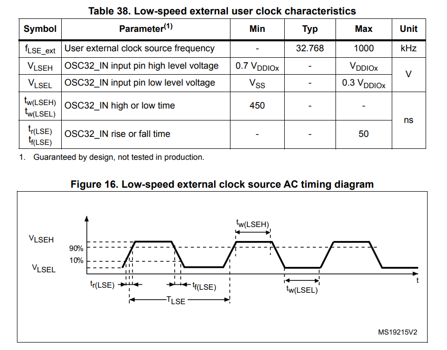
*(DS9826 Rev 6, Page 67)*

The maximum speed on the lowest setting for the STM32F072RB is 1kHz.

### What RCC register would you manipulate to enable the following peripherals: (use the comments next to the bit defines for better peripheral descriptions)

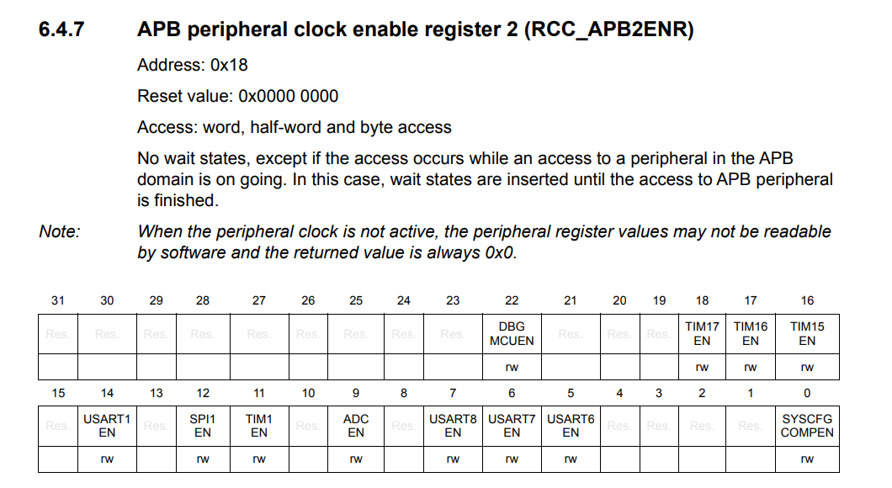
*(RM0091 Rev 10, Page 123)*

> TIM1 (TIMER1)

Setting TIM1EN in the APB Peripheral Clock Enable Register 2 (RCC -> APB2EN), will turn on the timer 1 peripheral.

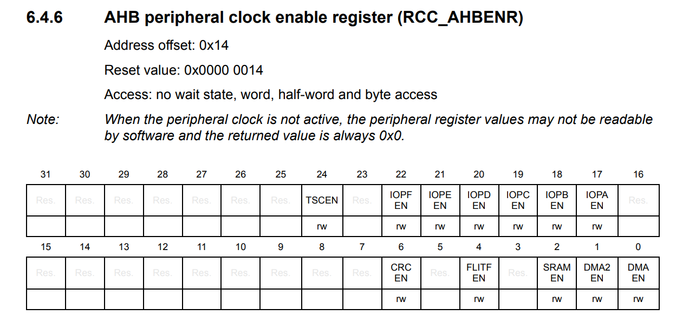
*(RM0091 Rev 10, Page 121)*

> DMA1

Setting DMAEN will in the AHB Peripheral Clock Enable Register (RCC -> AHBENR), will turn on the direct memory access 1 peripheral clock.

> I2C1

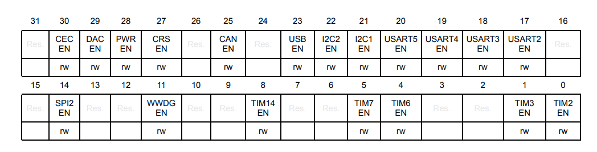
*(RM0091 Rev 10, Page 125)*

Setting I2C1 in the APB Peripheral Clock Enable Register 1 (RCC -> APB1EN), will turn on the I2C 1 peripheral clock.

### How many commits did you generate over the course of the lab?

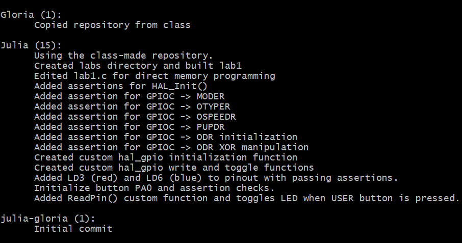
*(from my GitBash)*

The total number of commits I made for this lab, excluding the commit for this postlab is 17.