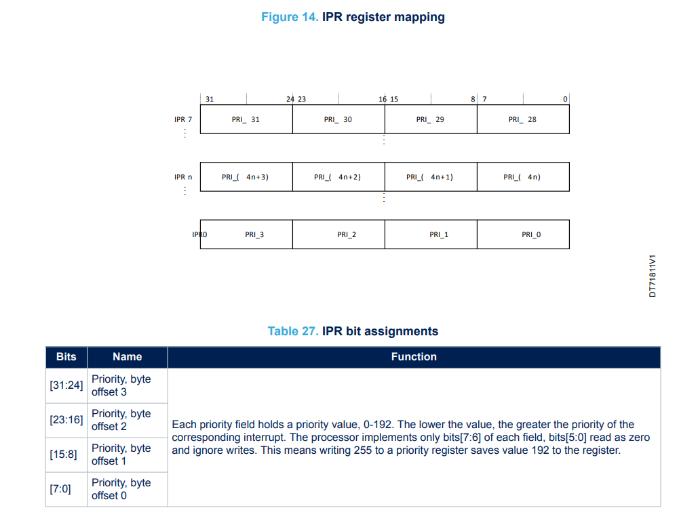

# ECE6780 Post-Lab 2

## Questions

### Why can't you use both pins PA0 and PC0 for external interrupts at the same time?

You cannot use both PA0 and PC0 for external interrupts because the EXTI control register can only take 1 pin from each of the 6 groups of GPIO pins for the corresponding 16 GPIO pins.

### What software priority level gives the highest priority? What level gives the lowest?

While there are technically some interrupts with negative interrupts of -1, the highest priority is 0, as the lowest number has more priority over a higher number. with the lowest priority being 3.

### How many bits does the NVIC have reserved in its priority (IPR) registers for each interrupt (including non-implemented bits)? Which bits in the group are implemented?

(*PM0215 Rev 2, Page 54*)

The programming manual states that there are 32 bits (0-31) in the IPRx register which only take into account 8 bits for each priority, shifted to the next 8 bits depending on the priority. It also states that for each 8 bits of the register, only the 6th and 7th bits are implemented by the processor, leaving the remaining 6 bits to be read as 0, and cannot be written to.

### What was the latency between pushing the Discovery board button and the LED change (interrupt handler start) that you measured with the logic analyzer? Make sure to include a screenshot in the post-lab submission.

I was not able to measure the delay between pushing the button and the LED change. I apologize for not having the time to do it.

### Why do you need to clear status flag bits in peripherals when servicing their interrupts?

Clearing the flag acts as a way to tell the processor that the interrupt has been handled and can return to the next part of the program. If the flag is not cleared, it would stay in the same interrupt handler, until it is cleared.