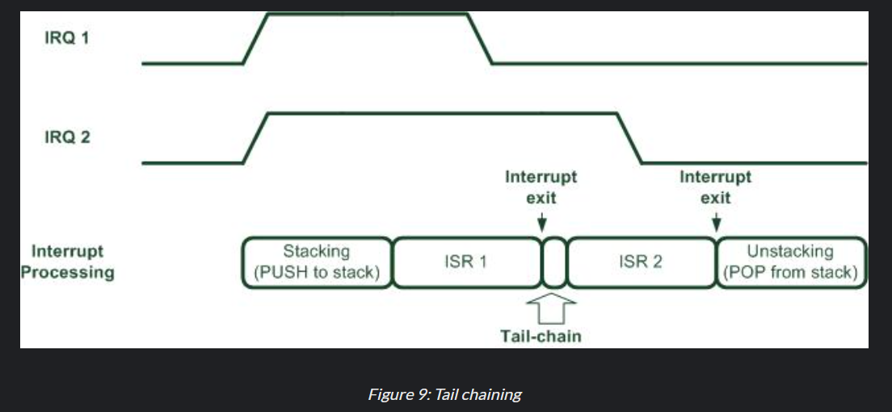
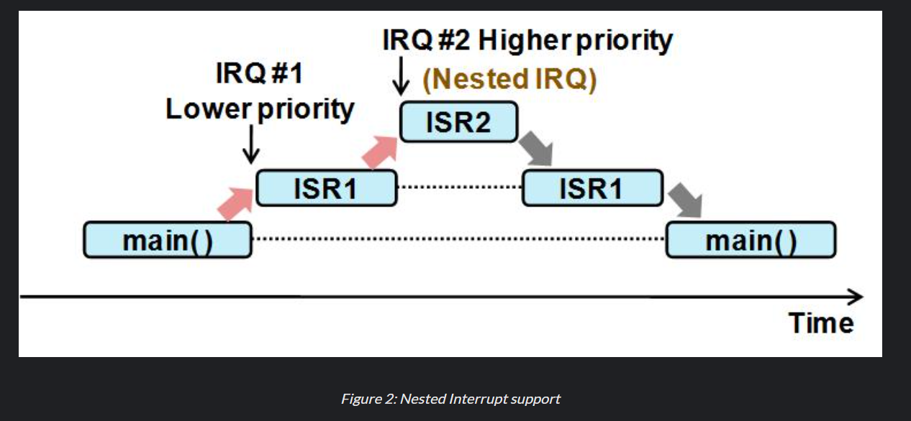
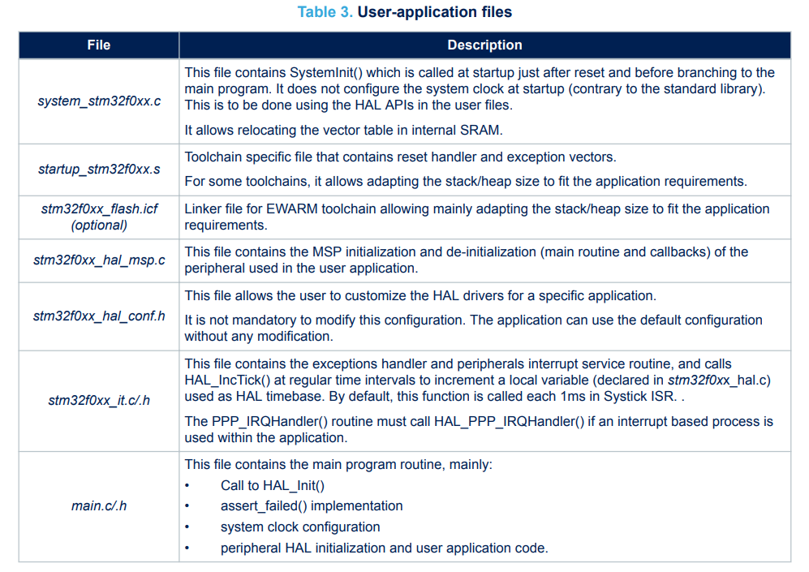

# ECE6780 Pre-Lab 2

## Questions

### What is the purpose of the NVIC peripheral?

The Nested Vectored Interrupt Controller (NVIC) peripheral manages all interrupts, including core exceptions, in the STM32F0x chips. It is closely coupled with the processor core interface, "which enables low latency interrupt processing and efficient processing of late arriving interrupts" (*RM0091 Rev 10, Page 215*). 

It's a separate circuit dedicated to handling the interrupts in the STM32F0x chips. It is closely coupled with the main processor to stop processes from occurring when the interrupt is unmasked.

### What is the difference between interrupt tail-chaining and nesting?

Tail-chaining is when an interrupt service routine (ISR) is completed, and another ISR needs to be served, the processor will switch to the other ISR sequentially as soon as possible, without needing to know the previous saved state of the processor. This would save some bandwidth as it would not need to access memory.

(*from [ARM Website](https://developer.arm.com/community/arm-community-blogs/b/architectures-and-processors-blog/posts/beginner-guide-on-interrupt-latency-and-interrupt-latency-of-the-arm-cortex-m-processors)*)

Alternatively, nesting is during a lower-priority ISR, a high-priority interrupt can occur which will pause the state of the previous ISR, allowing to be brought back to the lower-priority ISR when the higher-priority ISR is finished. This has a lot more operations on memory which can be tolling on the processor if there's a lot of nested interrupts.

(*from [ARM Website](https://developer.arm.com/community/arm-community-blogs/b/architectures-and-processors-blog/posts/beginner-guide-on-interrupt-latency-and-interrupt-latency-of-the-arm-cortex-m-processors)*)

ARM processors support both of these operations.

### In what file are the CMSIS libraries that control the NVIC?

(*UM1785 Rev 7, Page 8*)

The CMSIS libraries that control the NVIC are the startup_stm32f0xx.s, which contain reset handler and exception vectors; stm32f0xx_it.c/.h, which contain exception handlers and peripheral interrupt service routines; and stm32f072xb.h, which includes the core_cm0.h to define the memory addresses for each register in the vector table.

### What is the purpose of the EXTI peripheral?

"The EXTI controller provides interrupt detection, masking and software trigger." (*[STM32U0-EXTI Presentation](https://www.st.com/content/ccc/resource/training/technical/product_training/group1/e2/9c/47/09/52/36/48/e0/stm32u0-system-extended-interrupt-event-controller-exti/files/stm32u0-system-extended-interrupt-event-controller-exti.pdf/jcr:content/translations/en.stm32u0-system-extended-interrupt-event-controller-exti.pdf) Slide 3*)

The EXTI basically acts as a bridge between the GPIO pins and the NVIC to allow interrupts to occur in the processor.

### What is the purpose of the SYSCFG pin multiplexers?

The System Configuration (SYSCFG) is a module which contains a set of configuration settings stored in registers. The multiplexers attached to each of these registers gives a specific output depending on the configuration.

### What file has the defined names for interrupt numbers?

The stm32f072xb.h has the defined names for interrupt numbers and the memory address for each register in the vector table.

### What file has the Vector table implementation?

The core_cm0.h has the vector table implementation.