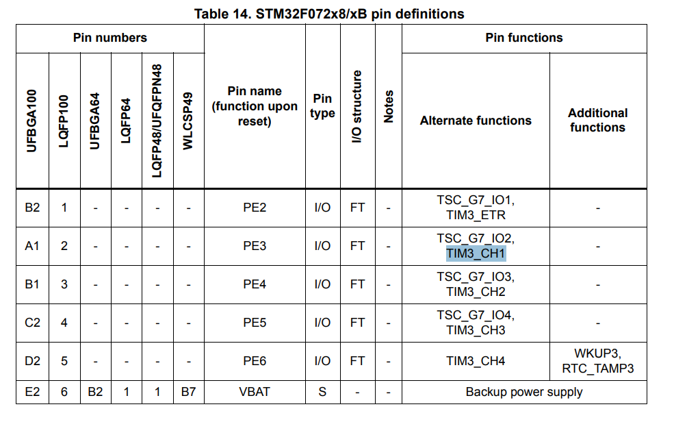
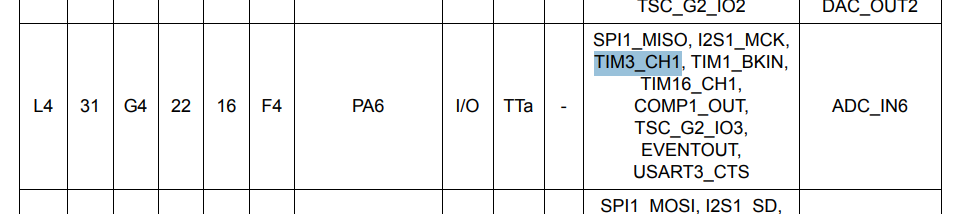
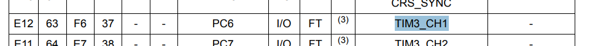
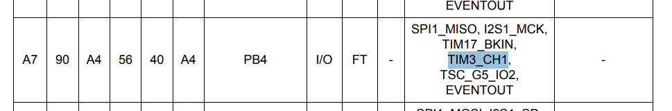
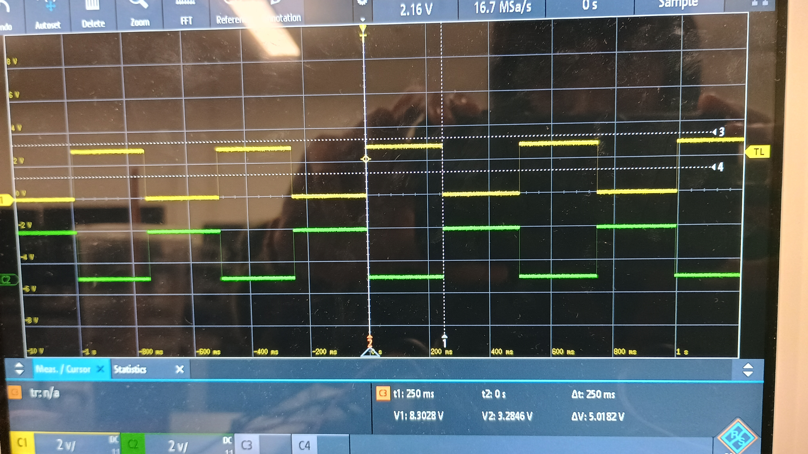
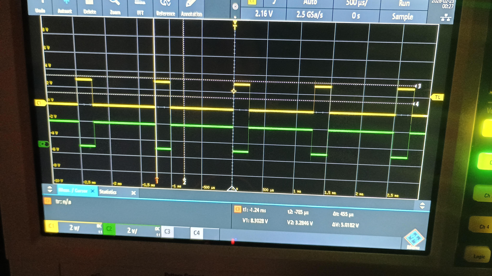
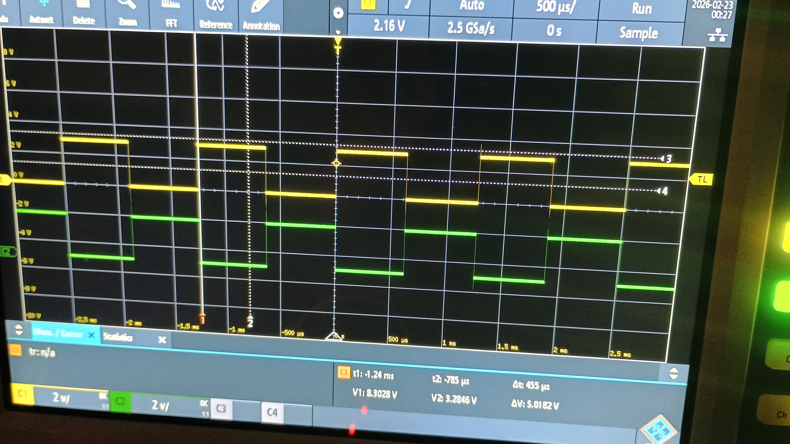
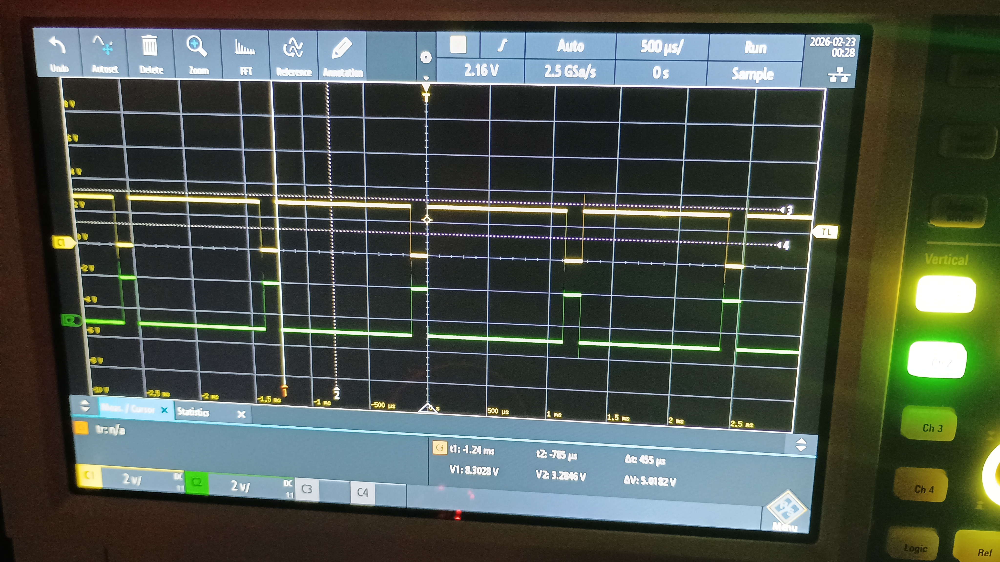
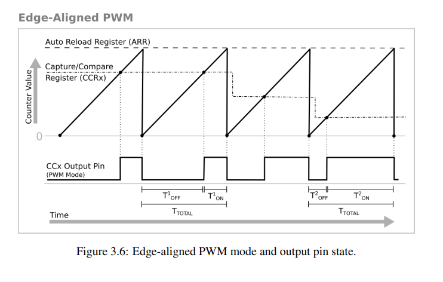

# ECE6780 Post-Lab 3

## Questions

### Using a timer clock source of 8 MHz, calculate PSC and ARR values to get a 60 Hz interrupt.

> 8000000 MHz / 60 Hz = 133333.33

> 133333.33 / 1000 = 133.33

> 1000 = ARR

> 133 - 1 = PSC

> 132 = PSC

An ARR of 1000 and a PSC of 132 would approximately give around a 60 Hz interrupt.

### Look through the Table 13 "STM32F072x8/xB pin definitions" in the chip datasheet and list all pins that can have the timer 3 capture/compare channel 1 alternate function.

(*DS9826 Rev 6 Pages 36, 38, 40, and 42*)

The pins that have a connection to the timer 3 capture/compare channel 1 alternate function are PE3, PA6, PC6, and PB4. PC6 is used in this lab for the red LED (LD3).

### List your measured value of the timer UEV interrupt period from first experiment.

(*Oscilloscope picture of period between each event generated from timer 2*)

I got a recodrded value of 250 ms, which aligns with the 4 Hz target that we wanted. 

### Describe what happened to the measured duty-cycle as the CCRx value increased in PWM mode 1.

> // Configuring OC1M to PWM Mode 2 and OC2M to PWM Mode 1

Channel 1 (PC6/LD3) is set to PWM Mode 2, while channel 2 (PC7/LD6) is set to PWM Mode 1.

(*20 percent duty cycle*)

(*50 percent duty cycle*)

(*90 percent duty cycle, the oscilloscope shows TIM3_CH1 (PC6/LD3) in green and TIM3_CH2 (PC7/LD6) in yellow*)

The yellow signal shows PWM Mode 1 changing over time. As the duty cycle gets larger for PWM Mode 1, the amount of time in which the signal is on increases. This is a 1-to-1 relationship to the duty cycle set by the timer.

### Describe what happened to the measured duty-cycle as the CCRx value increased in PWM mode 2.

The green signal shows PWM Mode 2 changing over time. As the duty cycle gets larger for PWM Mode 2, the amount of time in which the signal is on decreases. This is an inverse relationship to the duty cycle set by the timer.

### Include at least one logic analyzer screenshot of a PWM capture.

The images from the oscilloscope are given above for each duty cycle.

### What PWM mode is shown in figure 3.6 of the lab manual (PWM mode 1 or 2)?

The figure shows PWM Mode 2, where the duty cycle set by the CRR shows the proportion of time where the signal is turned off. We can see as the CCR register decreases, which is a reduction of the duty cycle, the time the signal is turned on gets larger. This matches the behavior of the observed green signal, which is TIM3_CH1 (PC6/LD3), which uses PWM Mode 2.

