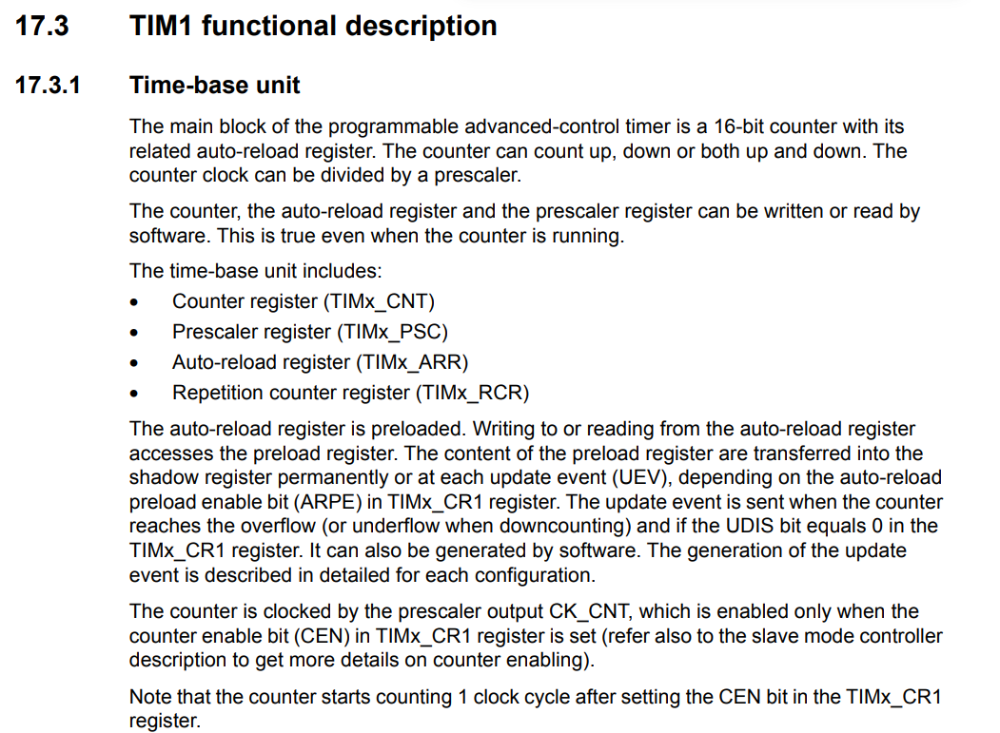
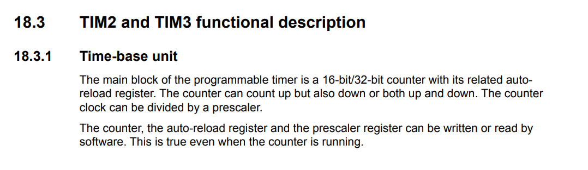
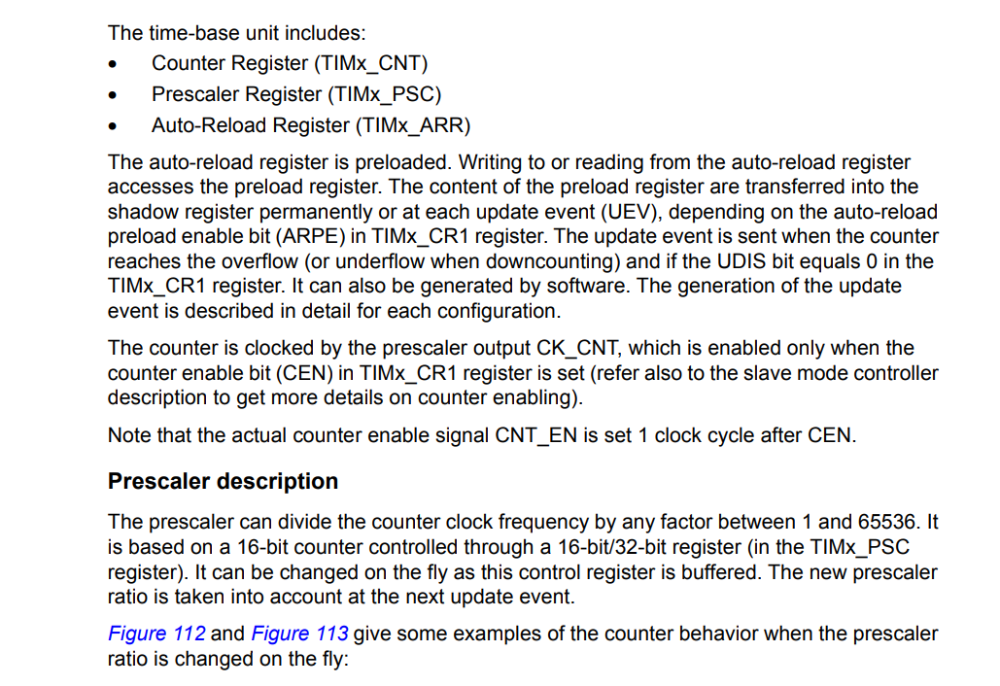
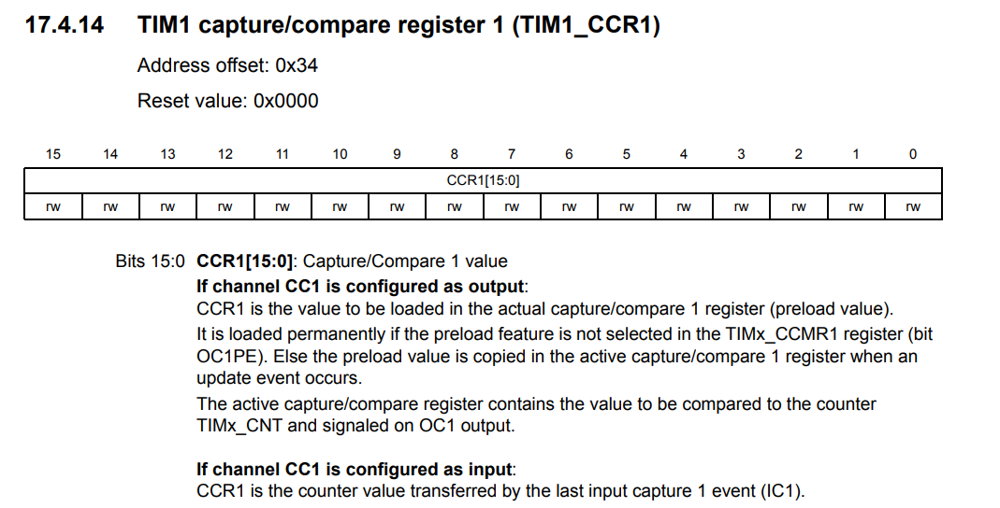
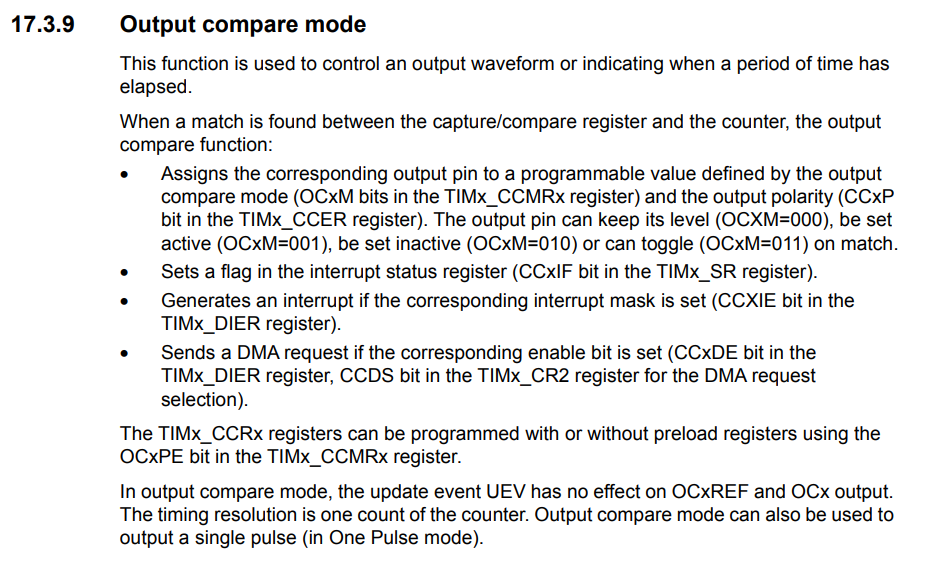
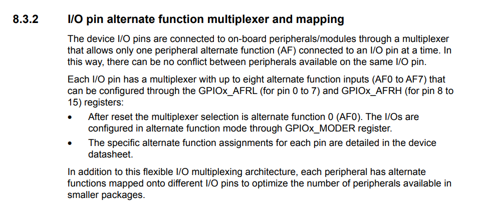
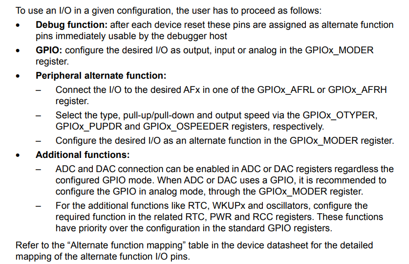

# ECE6780 Pre-Lab 3

## Questions

### List two things you can learn from a peripheral's functional description in the peripheral reference manual?

(*RM0091 Rev 10, Page 330*)

The functional description provides a description of what the peripheral does, with more practical attributes such as what can be manipulated using registers, such as pre-scalars for the timer 1 (TIM1) peripheral. The functional description also provides the specific registers associated with the peripheral, such as the counter register (TIMx_CNT) and the prescalar register (TIMx_PSC). 

### What is the title of the first sub-section in the functional description of timers 2 and 3?  Not mentioned in the lab manual; look it up!

(*RM0091 Rev 10, Page 405 - 406*)

The first sub-section of the functional description of timer 2 (TIM2) and timer 3 (TIM3) is the time-base unit, which contains concise descriptions of the counter register (TIMx_CNT), prescalar register (TIMx_PSC), and auto-reload register (TIMx_ARR). Unlike TIM1's time-base unit, the TIM2 and TIM3 timers don't have a repetition counter register (TIMx_RCR).

The RCR register is only present in TIM1, because it is used to describe the duty cycle of a pulse wave modulation (PWM) event. This basically means that the PWM for timer one would be RCR/ARR. TIM2 and TIM3 do not have a pulse width modulation mode.

### What is the purpose of the Prescaler (PSC) register?

The prescalar register (TIMx_PSC) determines the frequency at which the timer updates by dividing the frequency it would have by a given prescalar number (/1, /2, /4, /16). This would not change the count the timer goes to, but would change the time it takes to complete a full count cycle.

### What is the purpose of the Auto-Reload (ARR) register?

The purpose of the auto-reload register (ARR) determines when the timer should reset to 0. After each clock cycle, the timer would count upwards until reaching the ARR register value. This ARR value is a placeholder to be sent to the actual reload register in the timer.

### What is the purpose of the Capture/Compare (CCRx) register while the timer is operating in Output Compare mode?

(*RM0091 Rev 10, Page 396*)

The purpose of the CCR registers while the timer is operating in output mode is to compare the number in the timer TIMx_CNT to the number in the capture/compare register (TIMx_CCRx).

The output compare mode states that depending on the configuration of the CCR and other peripherals, you can have an interrupt occur, you could set the pin to be high until the next CCR cycle, you could create PWM waves, or you could read directly the register to know the timer has reached that count. This can change the functional output of a given pin in the CCR, as the interrupt flag would need to be cleared to start back the timer. This could account for more precise timings after a given interrupt ends.

###  What does the duty-cycle of a PWM signal represent?

The duty-cycle represents how long a PWM signal is on for as a ratio of the entire clock cycle. 100% duty cycle would always be turned on, while a 0% duty cycle would always be turned off. A 75% duty cycle would be turned on 75% of the time and turned off 25% of the time.

### What is the purpose of the Alternate Function mode for a GPIO pin?

The alternate function mode for a GPIO pin allows the GPIO pin to have a separate function from its traditional digital inputs and output configurations. This could allow analog-to-digital converters (ADC) or digital-to-analog converters (DAC), pulse-width modulation (PWM), real time clocks (RTC), and more. For using the CCR output function to allow a pin to use PWM on the output compare mode of a timer, it would need to use an alternate function mode GPIO pin.

### In what document can you find the documentation for what GPIO pins have which alternate functions?

(*RM0091 Rev 10, Page 151 - 152*)