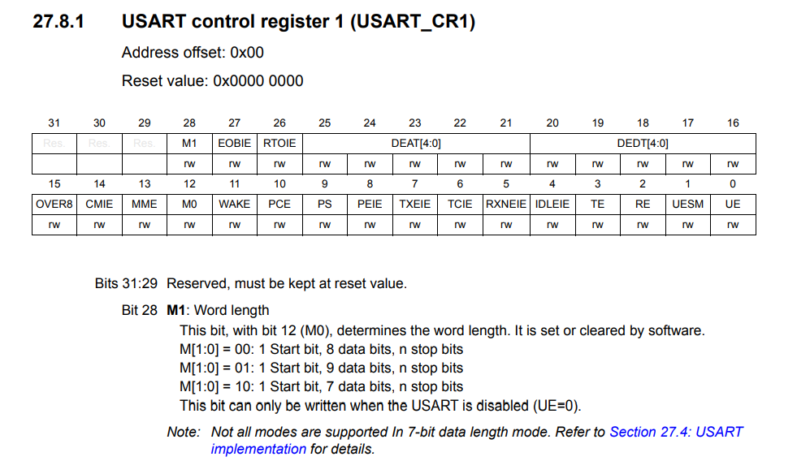
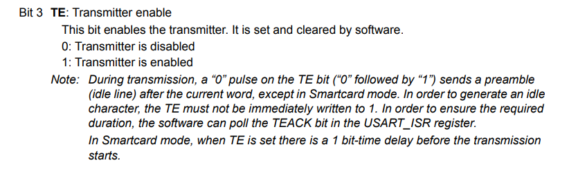

# ECE6780 Pre-Lab 4

## Questions

### What is the difference between a parallel and serial interface?

Using this article from [DigiKey](https://www.digikey.com/en/maker/tutorials/2023/what-is-serial-communication-and-how-does-it-compare-to-parallel), serial communication only uses 1 line of communication to send a string of data in time, having not as much throughput as parallel communication, which can send a lot of information at once, greatly increasing the throughput.

### What is the difference between a synchronous and asynchronous interface?

Using the same website, synchronous communication utilizes the same clock for receiving and transmitting data, while asynchronous interfaces rely on an accepted baud rate rather than a physical clock to send and receive data. There are advantages and disadvantages to using one over the other.

### What is one thing that a communication protocol does?

A communication protocol makes sure to encrypt data from the transmitter to be read back correctly through the receiver. Protocols should allow data to remain the same, so that information isn't loss during the transmission. This property in communication protocols is called reliability.

### What does the baud rate of a signal mean?

The baud rate of a signal means the number of changes in a signal that can occur per second. This is not the same as bitrate, as you can send more bits than the number of changes that can occur in a signal. This does mean that the number of different bits is greatly limited by the baud rate. Some baud rates can only take 9600 changes in a signal per second, which would limit a signal to 9600 bit changes in a second.

### What register in the USART would you use to enable the transmitter hardware?

(*RM0091 Rev 10, 744 - 746*)

The USART control register has a transmitter enable bit which can be turned on to turn on the transmitter hardware.

### Does the transmit (TX) line of the USB-USART cable connect to the transmit (TX) or receive (RX) of the STM32F0?

The transmit (TX) line of a USB-USART cable would connect to the receive (RX) line of the STM32F0.