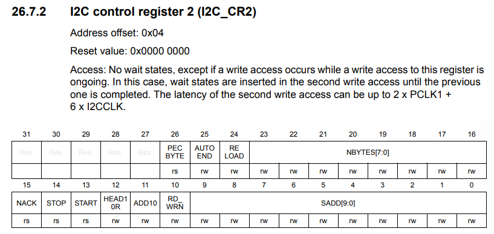
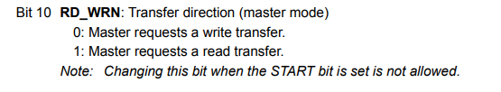
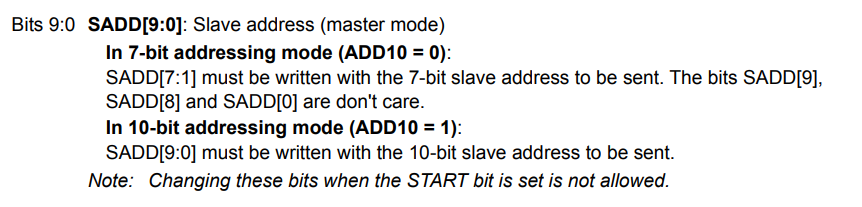

# ECE6780 Pre-Lab 5

## Questions

### Describe two differences between I2C master and slave devices?

To answer the following questions, I will be using this [website](https://www.gibbard.me/beginners_guide_to_i2c/).

The master device controls the I2C bus and sends commands to the slave devices on the bus, while the slave devices respond to commands from the master device.

### What are the two connections in an I2C bus? Describe their purpose.

The two connections are the serial data line (SDA) and serial clock line (SCL). When the I2C bus is idle, both SDA and SCL are set to high. 

When the master device wants to start communication, it first pulls SDA to low, then pulls SCL to low. This sequence let's the other devices on the bus know that the bus is in use. 

The stop condition tells all of the devices that communication is complete and the bus is free. The stop condition is when the master allows the SDA line to go high after the SCL line is set to high.

### What is the difference between open-drain and push-pull outputs?

The open-drain output allows to pull the line low, or allow it to float. The open-drain output has a pull-up resistor which allows the floating voltage to be around the same level of VDD.

A push-pull output allows to pull the line low, directly to ground, or high, directly to VDD. This can have an unintended consequence of sometimes two devices on the bus trying to force both VCC and GND, which would cause a short circuit.

With this reason, an open-drain output is optimal for I2C, since it can account for unintended short-circuiting.

### What is the purpose of the I2C restart condition?

The restart condition is when the start condition is called when the stop condition has not been called. This can be done, by setting SDA to high before SCL, then setting SDA to low and SCL to low, setting the I2C devices to the start condition without calling the stop condition.

### What peripheral register would you use to set the read/write direction of the next I2C transaction?

(*RM0091 Rev 10 687-688*)

The read and write direction is set by the RD_WRN bit in the I2C control register 2 (I2C_CR2).

### The 10-bit SADD bit-field holds the slave device address. Since standard I2C addresses only use 7 bits, to which bits in the bit-field would you write the shorter address?

(*RM0091 Rev 10 689*)

In 7-bit addressing mode, bits 7:1 are is where the address should be written to, where SADD[9], SADD[8], SADD[0] are don't care.

### Name one thing you found confusing or unclear in the lab.

The restart condition did not make sense when reading it at first, but I realized after looking at a diagram that you could have the bus line go back into the start condition without needing to go into the stop condition.