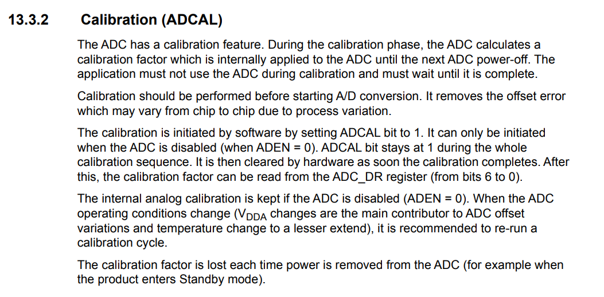
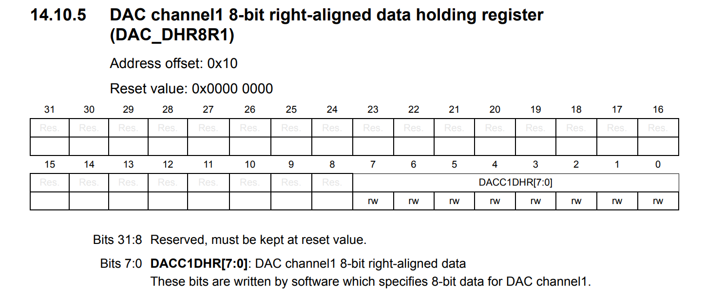

# ECE6780 Pre-Lab 5

## Questions

### What is hysteresis and how does it help prevent bad behavior on digital inputs?

Hysteresis is when the voltage thresholds for the analog signal to trigger changes depending on the current state of the voltage signal. For example, when a signal is triggered to a high voltage, the threshold to transition to a lwo digital signal becomes lower than the initial trigger. This will allow a lot of tolerance for a signal to have fluctuations, preserving data affected by noise.

### What is quantization?

Quantization is the process of taking a high resolution analog signal to a lower resolution digital signal. This is done through a cascading number of triggers for different thresholds, over a discrete number of possible values. This allows an analog signal to be represented by a digital signal.

### What does Nyquist theory explain? What is the problem with sampling a signal too slowly?

The Nyquist theory explains that the same two signals could have the exact same sampling points given not enough samples are collected by the sampling. This is explained through a fourier transform analysis of signals, being composed of the same frequencies at different degrees of magnitude. The Nyquist Criterion states that you would generally want the sampling frequency to be twice the largest frequency of a given signal.

### The maximum resolution of the ADC is 12-bits. How many quantization steps/values does this give us?

> 212 = 4096

Finding the total number of possible combinations for the given bitwidth, we get 4096, so there would be a total of 4096 quantization steps (0 - 4095).

### What are the steps to perform an ADC calibration?

(*RM0091 Rev 10, Page 236*)

From the peripheral manual, we have to ensure that the device is turned off, the analog digital enable register (ADEN) has to be cleared. The direct memory access enable register (DMAEN) should also be turned off so the value cannot be read by the chip. The peripheral is then turned off and not communicating to the core chip. The ADC Calibration can then be turned on by setting the ADCAL register to 1, and waiting until the ADCAL register becomes 0, before performing any other steps. This ensures the ADC is calibrated.

### What’s the difference between right and left-aligned data in the DAC registers?

Right-aligned registers have their bits sent to the least significant bits (LSB), which allow for a simple read-out for the signal given in 12-bits, a left-aligned DAC has their most significant bit (MSB) to the MSB of the full register. This would shift the bit however many bits down the register to be to the left-most spot. This would allow for easier data manipulation without having to manually shift the bits yourself. Depending on the representation of the bits, it would be easier to have a 0 - 4095 range on the right-aligned DAC and it would be easier to deal with +/- 2047 on the left-aligned DAC.

### What DAC register would you use to write 8-bit right-aligned data? (use the peripheral reference manual)

The DAC DHR8R1 register can be used to write 8-bit right-aligned data.

### Name something you found confusing or unclear in the lab manual. If everything was clear, simply answer that you didn’t have any issues

The difference between left- and right- aligned registers was easy to understand. It was mostly their application as to what advantages they may have that were difficult to find. I am not entirely sure if my answer is correct, but it was satisfying to me.