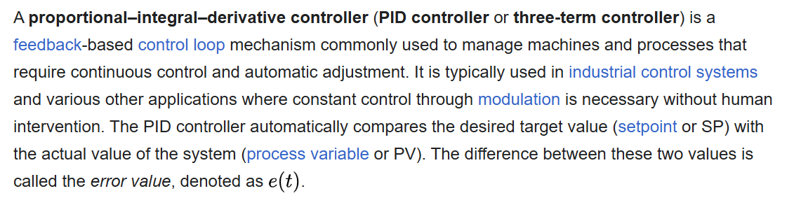

# ECE6780 Pre-Lab 7

## Questions

### 1. What is the basic difference between an open and closed-loop control system?

"Open-loop systems apply a process or algorithm to directly generate their output state from their inputs; they have no method
of measuring the actual effect of their actions. Closed-loop control systems use their own output as a secondary input, and calculate a course of action depending on the error between the desired and current state. This process is called feedback." (*Lab 7 Manual*). 

Open-loop systems basically only generate an output from inputs, while closed-loop systems use the output as an input to update the new output.

### 2. What does the acronym "PID" stand for?

PID stands for "Proportional-Integral-Derivative". This is a closed-loop type system that compares the actual output of the system to the desired output that it should be at, and changes the signal going through the system to get to that desired value.

### 3. When does proportional control lose effectiveness?

Proportional control loses effectiveness when the system being measured against is non-linear. This is because the expected outcome is harder to predict through simply changing the proportion of control.

### 4. Did you watch the intro videos?

Yes